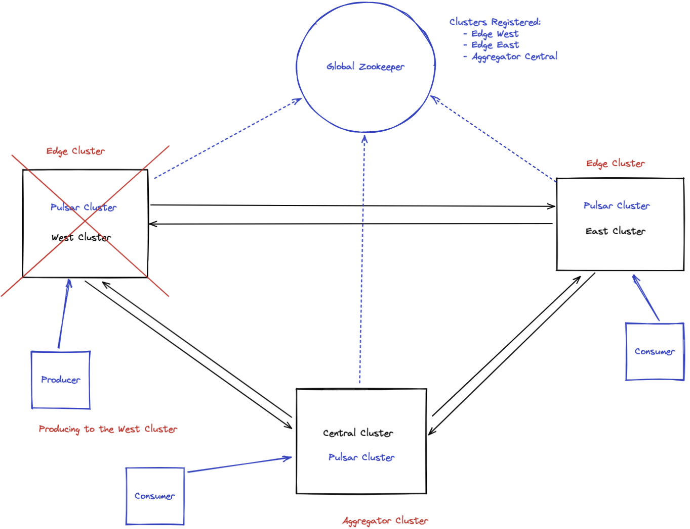
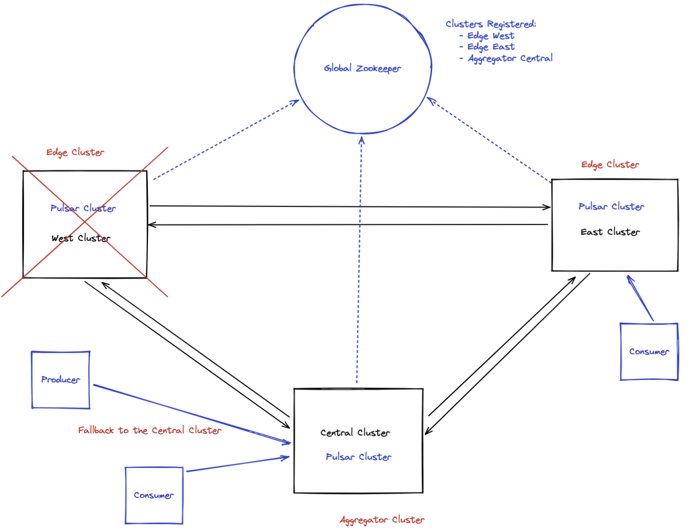

Geo-Replication Demo
--------------------
The purpose of this repo is to demonstrate how you leverage Pulsar's Geo-Replication in order to design and implement disaster recovery solutions.
In this demo we will create a full-mesh replication between 3 different Pulsar Clusters under one 
Global Zookeeper Configuration Store.

### Deploy 3 Pulsar Clusters with one Global Zookeeper


### Create Producers and Consumers on the clusters


### Simulate a Cluster Failure


### Resume on the Failover Cluster


1List eu-central EKS clusters
```shell
aws eks list-clusters --region eu-central-1
```

2. Setup your kubeconfig kubeconfig
```shell
aws eks --region eu-central-1 update-kubeconfig \
  --name sn-hare-dev-eu-central-1
```

3. Create the namespaces
```shell
kubectl create ns global
kubectl create ns central
kubectl create ns east
kubectl create ns west
```

4. Install the k8s operator
```shell
helm upgrade --install pulsar-operator streamnative/pulsar-operator -n default
```

5. Deploy a global zookeeper - global configuration store
```shell
helm install -f k8s/values-global.yaml global-zk streamnative/sn-platform --set initialize=true -n global
```

6. Get a terminal in the zookeeper pod 
```shell
kubectl exec -it global-zk-sn-platform-zookeeper-0 -n global -- bash
```

7. Deploy the pulsar-west edge cluster
```shell
helm install -f k8s/values-sn.yaml pulsar-west streamnative/sn-platform --set initialize=true -n west
```

8. Deploy the pulsar-east edge cluster
```shell
helm install -f k8s/values-sn.yaml pulsar-east streamnative/sn-platform --set initialize=true -n east
```

9. Deploy the pulsar-central aggregator cluster
```shell
helm install -f k8s/values-sn.yaml pulsar-central streamnative/sn-platform --set initialize=true -n central
```

10. Get a shell in each cluster's toolset pod
```shell
kubectl exec -it pulsar-east-sn-platform-toolset-0 -n east -- bash
kubectl exec -it pulsar-west-sn-platform-toolset-0 -n west -- bash
kubectl exec -it pulsar-central-sn-platform-toolset-0 -n central -- bash
```

11. Create a tenant and namespace on one cluster e.g west and verify it's visible on the others as well
```shell
bin/pulsar-admin tenants create testt --allowed-clusters pulsar-west-sn-platform,pulsar-east-sn-platform,pulsar-central-sn-platform
bin/pulsar-admin namespaces create testt/testns --clusters pulsar-west-sn-platform,pulsar-east-sn-platform,pulsar-central-sn-platform

bin/pulsar-admin tenants list
bin/pulsar-admin namespaces testt
```

12. Expose the services so we can access the clusters from our local environment
```shell
kubectl port-forward service/pulsar-west-sn-platform-proxy-headless 8080:8080 6650:6650 -n west
kubectl port-forward service/pulsar-east-sn-platform-proxy-headless 8081:8080 6651:6650 -n east
kubectl port-forward service/pulsar-central-sn-platform-proxy-headless 8082:8080 6652:6650 -n central
```