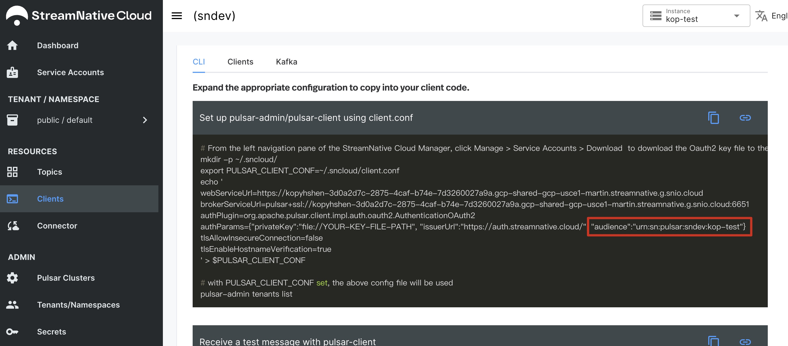
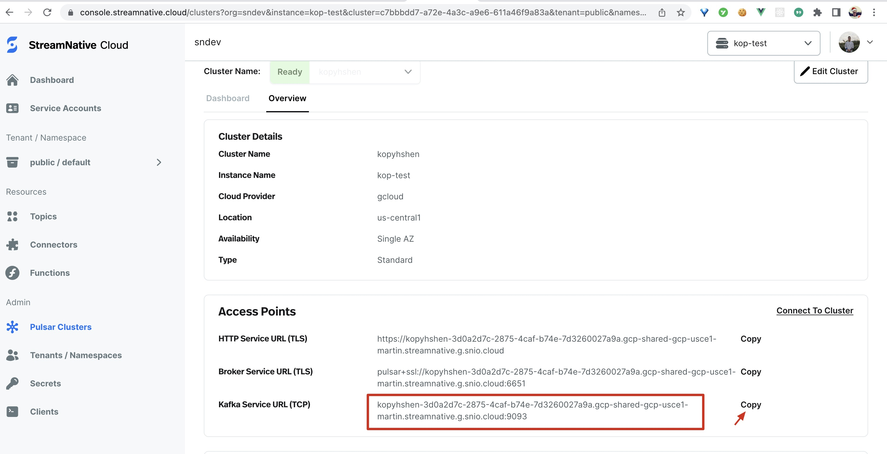

## Download Kafka 3.1.0 and Kop dependency

1️⃣ Download Kafka tarball in `~/kafka`:

```bash
mkdir -p ~/kafka && cd ~/kafka
# download Kafka 3.1.0
curl -O https://archive.apache.org/dist/kafka/3.1.0/kafka_2.13-3.1.0.tgz
tar xzf ./kafka_2.13-3.1.0.tgz
```

2️⃣ Download supplementary libraries of Kop:

```bash
# download supplementary libraries
curl -O https://repo1.maven.org/maven2/io/streamnative/pulsar/handlers/oauth-client/2.9.1.5/oauth-client-2.9.1.5.jar --output-dir ./kafka_2.13-3.1.0/libs
curl -O https://repo1.maven.org/maven2/org/apache/pulsar/pulsar-client-admin-api/2.9.2/pulsar-client-admin-api-2.9.2.jar --output-dir ./kafka_2.13-3.1.0/libs
curl -O https://repo1.maven.org/maven2/org/apache/pulsar/pulsar-client/2.9.2/pulsar-client-2.9.2.jar --output-dir ./kafka_2.13-3.1.0/libs
curl -O https://repo1.maven.org/maven2/org/apache/pulsar/pulsar-client-api/2.9.2/pulsar-client-api-2.9.2.jar --output-dir ./kafka_2.13-3.1.0/libs
```

## Start a local standalone Kafka connector

1️⃣ Config OAuth setting and broker url:

```bash
cd ~/kafka/kafka_2.13-3.1.0
vim config/connect-standalone.properties
```

We need to config both Kafka Connect workers, Source connectors and Sink connector:

```properties
bootstrap.servers=SERVER-URL

sasl.login.callback.handler.class=io.streamnative.pulsar.handlers.kop.security.oauth.OauthLoginCallbackHandler
security.protocol=SASL_SSL
sasl.mechanism=OAUTHBEARER
sasl.jaas.config=org.apache.kafka.common.security.oauthbearer.OAuthBearerLoginModule \
   required oauth.issuer.url="https://auth.streamnative.cloud/"\
   oauth.credentials.url="file://YOUR-KEY-FILE-PATH"\
   oauth.audience="YOUR-AUDIENCE-STRING";

producer.sasl.login.callback.handler.class=io.streamnative.pulsar.handlers.kop.security.oauth.OauthLoginCallbackHandler
producer.security.protocol=SASL_SSL
producer.sasl.mechanism=OAUTHBEARER
producer.sasl.jaas.config=org.apache.kafka.common.security.oauthbearer.OAuthBearerLoginModule \
   required oauth.issuer.url="https://auth.streamnative.cloud/"\
   oauth.credentials.url="file://YOUR-KEY-FILE-PATH"\
   oauth.audience="YOUR-AUDIENCE-STRING";

consumer.sasl.login.callback.handler.class=io.streamnative.pulsar.handlers.kop.security.oauth.OauthLoginCallbackHandler
consumer.security.protocol=SASL_SSL
consumer.sasl.mechanism=OAUTHBEARER
consumer.sasl.jaas.config=org.apache.kafka.common.security.oauthbearer.OAuthBearerLoginModule \
   required oauth.issuer.url="https://auth.streamnative.cloud/"\
   oauth.credentials.url="file://YOUR-KEY-FILE-PATH"\
   oauth.audience="YOUR-AUDIENCE-STRING";
```

The `YOUR-KEY-FILE-PATH` is the path of the OAuth key file of your servie account.

The `YOUR-AUDIENCE-STRING` can be found in StreamNative Cloud panel:



The `SERVER-URL` can be found in StreamNative Cloud panel too:



see [security for Kafka Connect](https://docs.confluent.io/platform/current/kafka/authentication_sasl/authentication_sasl_scram.html#kconnect-long) for more information.

2️⃣ Config source and sink properties.

We use `config/connect-file-source.properties` as the source config:

```properties
name=local-file-source
connector.class=FileStreamSource
tasks.max=1
file=test.txt
topic=connect-test
```

This source will read the `test.txt` file then send every line as a message to `connect-test` topic. So we create this file now:

```shell
touch test.txt
echo -e "foo\nbar" >> test.txt
```

We use `config/connect-file-sink.properties` as the sink config:

```properties
name=local-file-sink
connector.class=FileStreamSink
tasks.max=1
file=test.sink.txt
topics=connect-test
```

This source will read from the `connect-test` topic then write messages into `test.sink.txt`.

3️⃣ Now start a standalone Kafka connector:

```shell
bin/connect-standalone.sh config/connect-standalone.properties config/connect-file-source.properties config/connect-file-sink.properties
```

Wait a while, you can see the content in `test.txt` will be transferred to `test.sink.txt`:

```shell
cat test.sink.txt
```

The output will be:

```text
foo
bar
```

