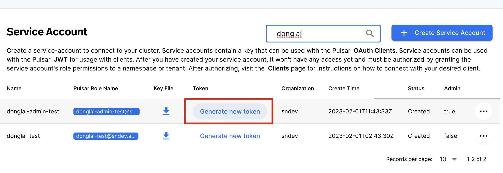

## Download Kafka 3.1.0 and Kop dependency

1. Download Kafka tarball in `~/kafka`:

```bash
mkdir -p ~/kafka && cd ~/kafka
# download Kafka 3.1.0
curl -O https://archive.apache.org/dist/kafka/3.1.0/kafka_2.13-3.1.0.tgz
tar xzf ./kafka_2.13-3.1.0.tgz
```

## Start MySQL and Debezium connector by docker-compose

1. Copy the following content to `docker-compose.yaml`:

```yaml
version: '2'
services:
  mysql:
    image: quay.io/debezium/example-mysql:2.1
    ports:
     - 3306:3306
    environment:
     - MYSQL_ROOT_PASSWORD=debezium
     - MYSQL_USER=mysqluser
     - MYSQL_PASSWORD=mysqlpw
  connect:
    image: quay.io/debezium/connect:2.1
    ports:
     - 8083:8083
    links:
     - mysql
    environment:
     - BOOTSTRAP_SERVERS=SERVER-URL
     - CONNECT_SECURITY_PROTOCOL=SASL_SSL
     - CONNECT_SASL_MECHANISM=PLAIN
     - CONNECT_SASL_JAAS_CONFIG=org.apache.kafka.common.security.plain.PlainLoginModule required username="public/default" password="token:YOUR-TOKEN";
     - CONNECT_PRODUCER_SECURITY_PROTOCOL=SASL_SSL
     - CONNECT_PRODUCER_SASL_MECHANISM=PLAIN
     - CONNECT_PRODUCER_SASL_JAAS_CONFIG=org.apache.kafka.common.security.plain.PlainLoginModule required username="public/default" password="token:YOUR-TOKEN";
     - CONNECT_CONSUMER_SECURITY_PROTOCOL=SASL_SSL
     - CONNECT_CONSUMER_SASL_MECHANISM=PLAIN
     - CONNECT_CONSUMER_SASL_JAAS_CONFIG=org.apache.kafka.common.security.plain.PlainLoginModule required username="public/default" password="token:YOUR-TOKEN";
     - GROUP_ID=1
     - CONFIG_STORAGE_TOPIC=my_connect_configs
     - OFFSET_STORAGE_TOPIC=my_connect_offsets
     - STATUS_STORAGE_TOPIC=my_connect_statuses
```
The `SERVER-URL` can be found in StreamNative Cloud panel too:


Besure to replace `YOUR-TOKEN` with your service account token:



2. Start MySQL and Debezium connector:

```shell   
docker-compose -f docker-compose.yaml up
```

## Start MySQL connector:

1. Copy the following content to `register-mysql.json`:
```json
{
    "name": "inventory-connector",
    "config": {
        "connector.class": "io.debezium.connector.mysql.MySqlConnector",
        "tasks.max": "1",
        "database.hostname": "mysql",
        "database.port": "3306",
        "database.user": "debezium",
        "database.password": "dbz",
        "database.server.id": "184054",
        "topic.prefix": "dbserver1",
        "database.include.list": "inventory",
        "schema.history.internal.kafka.bootstrap.servers": "SERVER-URL",
        "schema.history.internal.consumer.security.protocol": "SASL_SSL",
        "schema.history.internal.consumer.sasl.mechanism": "PLAIN",
        "schema.history.internal.consumer.sasl.jaas.config": "org.apache.kafka.common.security.plain.PlainLoginModule required username=\"public/default\" password=\"token:YOUR-TOKEN\";",
        "schema.history.internal.producer.security.protocol": "SASL_SSL",
        "schema.history.internal.producer.sasl.mechanism": "PLAIN",
        "schema.history.internal.producer.sasl.jaas.config": "org.apache.kafka.common.security.plain.PlainLoginModule required username=\"public/default\" password=\"token:YOUR-TOKEN\";",
        "schema.history.internal.kafka.topic": "schema-changes.inventory"
    }
}
```

The `SERVER-URL` can be found in StreamNative Cloud panel too:


Besure to replace `YOUR-TOKEN` with your service account token:


2. Start MySQL connector
```shell
curl -i -X POST -H "Accept:application/json" -H  "Content-Type:application/json" http://localhost:8083/connectors/ -d @register-mysql.json
```

## Consume messages from a Debezium topic:

1. Create configuration file for JWT token:

```bash
# configure kafka-token.properties file.
echo 'security.protocol=SASL_SSL
sasl.mechanism=PLAIN
sasl.jaas.config=org.apache.kafka.common.security.plain.PlainLoginModule required username="public/default" password="token:YOUR-TOKEN";' > ~/kafka-token.properties
```
Besure to replace `YOUR-TOKEN` with your service account token:


2. Run a Kafka consumer start to receive from `dbserver1.inventory.customers`:

```shell
~/kafka/kafka_2.13-3.1.0/bin/kafka-console-consumer.sh \
    --bootstrap-server "SERVER-URL" \
    --consumer.config ~/kafka/kafka-token.properties \
    --from-beginning \
    --property print.key=true \
    --topic dbserver1.inventory.customers
```
The `SERVER-URL` can be found in StreamNative Cloud panel too:


## Modify records in the database via MySQL client

1. Enter the MySQL container:
```shell
docker-compose -f docker-compose.yaml exec mysql bash -c 'mysql -u $MYSQL_USER -p$MYSQL_PASSWORD inventory'
```

2. Modify records in the database:
```sql
UPDATE customers SET first_name='Bnne' WHERE id=1004;
```

Output example of the consumer:
```shell
{"schema":{"type":"struct","fields":[{"type":"int32","optional":false,"field":"id"}],"optional":false,"name":"dbserver1.inventory.customers.Key"},"payload":{"id":1004}}	{"schema":{"type":"struct","fields":[{"type":"struct","fields":[{"type":"int32","optional":false,"field":"id"},{"type":"string","optional":false,"field":"first_name"},{"type":"string","optional":false,"field":"last_name"},{"type":"string","optional":false,"field":"email"}],"optional":true,"name":"dbserver1.inventory.customers.Value","field":"before"},{"type":"struct","fields":[{"type":"int32","optional":false,"field":"id"},{"type":"string","optional":false,"field":"first_name"},{"type":"string","optional":false,"field":"last_name"},{"type":"string","optional":false,"field":"email"}],"optional":true,"name":"dbserver1.inventory.customers.Value","field":"after"},{"type":"struct","fields":[{"type":"string","optional":false,"field":"version"},{"type":"string","optional":false,"field":"connector"},{"type":"string","optional":false,"field":"name"},{"type":"int64","optional":false,"field":"ts_ms"},{"type":"string","optional":true,"name":"io.debezium.data.Enum","version":1,"parameters":{"allowed":"true,last,false,incremental"},"default":"false","field":"snapshot"},{"type":"string","optional":false,"field":"db"},{"type":"string","optional":true,"field":"sequence"},{"type":"string","optional":true,"field":"table"},{"type":"int64","optional":false,"field":"server_id"},{"type":"string","optional":true,"field":"gtid"},{"type":"string","optional":false,"field":"file"},{"type":"int64","optional":false,"field":"pos"},{"type":"int32","optional":false,"field":"row"},{"type":"int64","optional":true,"field":"thread"},{"type":"string","optional":true,"field":"query"}],"optional":false,"name":"io.debezium.connector.mysql.Source","field":"source"},{"type":"string","optional":false,"field":"op"},{"type":"int64","optional":true,"field":"ts_ms"},{"type":"struct","fields":[{"type":"string","optional":false,"field":"id"},{"type":"int64","optional":false,"field":"total_order"},{"type":"int64","optional":false,"field":"data_collection_order"}],"optional":true,"name":"event.block","version":1,"field":"transaction"}],"optional":false,"name":"dbserver1.inventory.customers.Envelope","version":1},"payload":{"before":{"id":1004,"first_name":"Bnne","last_name":"Kretchmar","email":"annek@noanswer.org"},"after":{"id":1004,"first_name":"Anne","last_name":"Kretchmar","email":"annek@noanswer.org"},"source":{"version":"2.1.4.Final","connector":"mysql","name":"dbserver1","ts_ms":1699509234000,"snapshot":"false","db":"inventory","sequence":null,"table":"customers","server_id":223344,"gtid":null,"file":"mysql-bin.000003","pos":1232,"row":0,"thread":23,"query":null},"op":"u","ts_ms":1699509234478,"transaction":null}}
```

## Shut down the cluster
```shell
docker-compose -f docker-compose.yaml down
```
