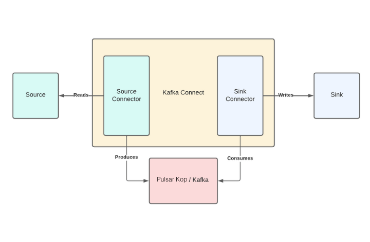

# Elasticsearch connect to StreamNative KoP cluster

## Prerequisites

To get started, you’ll need the following:

-   A macOS environment or an operating system of your choice. (This tutorial was developed on a macOS environment. If you choose another OS, please note that the commands might vary.)
-   A recent version of [Docker](https://docs.docker.com/get-docker/) installed on your machine (this article uses Docker Desktop 4.6.1).
-   The `jq` CLI, which provides JSON output formatting (`jq` can be downloaded from [here](https://stedolan.github.io/jq/download/)).


## Setting up Elasticsearch

In this tutorial, you’ll run Elasticsearch as a Docker container as well. In another terminal window, run the following command to execute Elasticsearch with the ports `9200` and `9300`:

```
docker run --name elastic-1 \
    -p 9200:9200 -p 9300:9300 -it \
    -e "discovery.type=single-node" \
    -e "xpack.security.enabled=false" \
    docker.elastic.co/elasticsearch/elasticsearch:7.17.2
```

The output should look like this:

```
...output omitted...
{"@timestamp":"2022-04-15T15:13:17.067Z", "log.level": "INFO", "message":"successfully loaded geoip database file [GeoLite2-Country.mmdb]", "ecs.version": "1.2.0","service.name":"ES_ECS","event.dataset":"elasticsearch.server","process.thread.name":"elasticsearch[efb7b3360ba3][generic][T#7]","log.logger":"org.elasticsearch.ingest.geoip.DatabaseNodeService","elasticsearch.cluster.uuid":"ocHgh5mAQROAlUofYHE3Cg","elasticsearch.node.id":"0aWiWmaBTgC0vdp6Zw_ZnQ","elasticsearch.node.name":"efb7b3360ba3","elasticsearch.cluster.name":"docker-cluster"}
{"@timestamp":"2022-04-15T15:13:17.118Z", "log.level": "INFO", "message":"successfully loaded geoip database file [GeoLite2-City.mmdb]", "ecs.version": "1.2.0","service.name":"ES_ECS","event.dataset":"elasticsearch.server","process.thread.name":"elasticsearch[efb7b3360ba3][generic][T#13]","log.logger":"org.elasticsearch.ingest.geoip.DatabaseNodeService","elasticsearch.cluster.uuid":"ocHgh5mAQROAlUofYHE3Cg","elasticsearch.node.id":"0aWiWmaBTgC0vdp6Zw_ZnQ","elasticsearch.node.name":"efb7b3360ba3","elasticsearch.cluster.name":"docker-cluster"}
```

Test the Elasticsearch instance with the following command:

```
curl 'http://localhost:9200'
```

The output should be as follows:

```json
{
  "name" : "eaf2be7fe2d6",
  "cluster_name" : "docker-cluster",
  "cluster_uuid" : "jolOS3_VRGq2-LpZbkT1kw",
  "version" : {
    "number" : "7.17.2",
    "build_flavor" : "default",
    "build_type" : "docker",
    "build_hash" : "de7261de50d90919ae53b0eff9413fd7e5307301",
    "build_date" : "2022-03-28T15:12:21.446567561Z",
    "build_snapshot" : false,
    "lucene_version" : "8.11.1",
    "minimum_wire_compatibility_version" : "6.8.0",
    "minimum_index_compatibility_version" : "6.0.0-beta1"
  },
  "tagline" : "You Know, for Search"
}
```

You’ve now successfully set up Elasticsearch on a Docker container.

## Setting up Kafka Connect

Kafka Connect is an integration tool that is released with the Apache Kafka project. It provides reliable data streaming between Apache Kafka and external systems and is both scalable and flexible. You can use Kafka Connect to integrate with other systems, such as databases, search indexes, and cloud storage providers. Kafka Connect also works with Pulsar KoP, which is compatible with the Kafka API.

Kafka Connect uses `source` and `sink` connectors for integration. Source connectors stream data from an external system to Kafka, while Sink connectors stream data from Kafka to an external system.



Kafka Connect is included with the Apache Kafka package. Navigate to the [Apache downloads page for Kafka](https://www.apache.org/dyn/closer.cgi?path=/kafka/3.1.0/kafka_2.13-3.1.0.tgz), and click the suggested download link for the Kafka 3.1.0 binary package.

Extract the Kafka binaries folder in the `_YOUR_HOME_DIRECTORY_/kafka_2.13-3.1.0` directory you created earlier.

### Download StreamNative OAuth dependency

We will use StreamNative Pulsar Cluster with KoP as the Kafak Cluster, so we need to download StreamNative OAuth dependencies.

```bash
# download supplementary libraries
curl -O https://repo1.maven.org/maven2/io/streamnative/pulsar/handlers/oauth-client/2.9.1.5/oauth-client-2.9 ./libs
curl -O https://repo1.maven.org/maven2/org/apache/pulsar/pulsar-client-admin-api/2.9.2/pulsar-client-admin-api-2.9.2.jar --output-dir ./libs
curl -O https://repo1.maven.org/maven2/org/apache/pulsar/pulsar-client/2.9.2/pulsar-client-2.9.2.jar --output-dir ./libs
curl -O https://repo1.maven.org/maven2/org/apache/pulsar/pulsar-client-api/2.9.2/pulsar-client-api-2.9.2.jar --output-dir ./libs
```

### Download Elasticsearch Sink connector

Create a `connectors` folder to store all kafka connectors.

```bash
# come to your kafka folder
cd kafka_2.13-3.1.0
# create a connector folder to store all kafka connectors
mkdir connectors
```

Navigate to this [Elasticsearch Sink connector](https://www.confluent.io/hub/confluentinc/kafka-connect-elasticsearch) and click **Download** to download the archived binaries. Unzip the file and copy the unziped folder into the `connectors` directory.

### Configuring the Kafka connect

To run a Kafka Connect cluster, we need to create a configuration file in the `properties` format.

```bash
# come to your kafka folder
cd kafka_2.13-3.1.0
# create a connect configuration file
# which contains information of Kafka server (StreamNative KoP cluster)
vim conf/connect-sn-kop.properties
```

Add the following content to `conf/connect-sn-kop.properties`:

```conf
# add the information of StreamNative KoP cluster
bootstrap.servers=SERVER-URL

sasl.login.callback.handler.class=io.streamnative.pulsar.handlers.kop.security.oauth.OauthLoginCallbackHandler
security.protocol=SASL_SSL
sasl.mechanism=OAUTHBEARER
sasl.jaas.config=org.apache.kafka.common.security.oauthbearer.OAuthBearerLoginModule \
   required oauth.issuer.url="https://auth.streamnative.cloud/"\
   oauth.credentials.url="file://YOUR-KEY-FILE-PATH"\
   oauth.audience="YOUR-AUDIENCE-STRING";

producer.sasl.login.callback.handler.class=io.streamnative.pulsar.handlers.kop.security.oauth.OauthLoginCallbackHandler
producer.security.protocol=SASL_SSL
producer.sasl.mechanism=OAUTHBEARER
producer.sasl.jaas.config=org.apache.kafka.common.security.oauthbearer.OAuthBearerLoginModule \
   required oauth.issuer.url="https://auth.streamnative.cloud/"\
   oauth.credentials.url="file://YOUR-KEY-FILE-PATH"\
   oauth.audience="YOUR-AUDIENCE-STRING";

consumer.sasl.login.callback.handler.class=io.streamnative.pulsar.handlers.kop.security.oauth.OauthLoginCallbackHandler
consumer.security.protocol=SASL_SSL
consumer.sasl.mechanism=OAUTHBEARER
consumer.sasl.jaas.config=org.apache.kafka.common.security.oauthbearer.OAuthBearerLoginModule \
   required oauth.issuer.url="https://auth.streamnative.cloud/"\
   oauth.credentials.url="file://YOUR-KEY-FILE-PATH"\
   oauth.audience="YOUR-AUDIENCE-STRING";

#Cluster level converters
#These applies when the connectors don't define any converter
key.converter=org.apache.kafka.connect.json.JsonConverter
value.converter=org.apache.kafka.connect.json.JsonConverter

#JSON schemas enabled to false in cluster level
key.converter.schemas.enable=true
value.converter.schemas.enable=true

#Where to keep the Connect topic offset configurations
offset.storage.file.filename=/tmp/connect.offsets
offset.flush.interval.ms=10000

#Plugin path to put the connector binaries
plugin.path=YOUR-FULL-PATH/connectors/
```

The `YOUR-KEY-FILE-PATH` is the path of the OAuth key file of your servie account.

The `YOUR-AUDIENCE-STRING` can be found in StreamNative Cloud panel:


The `SERVER-URL` can be found in StreamNative Cloud panel too:


see [security for Kafka Connect](https://docs.confluent.io/platform/current/kafka/authentication_sasl/authentication_sasl_scram.html#kconnect-long) for more information.

The `YOUR-FULL-PATH/connectors/` means the full path of `connectors` folder we created just now.

Also, we need to config a `JsonConverter` because we will send json format messages to Kafka.

### Configuring the Elasticsearch sink connector

Just now we configed the Kakfa connect server, now we need to config the Elasticsearch sink connector.

Add the following content to `conf/elasticsearch-sink-connector.properties`:

```conf
name=elasticsearch-sink
connector.class=io.confluent.connect.elasticsearch.ElasticsearchSinkConnector
tasks.max=1
# Topic name to get data from
topics=test-elasticsearch-sink
key.ignore=true
# The key converter for this connector
key.converter=org.apache.kafka.connect.storage.StringConverter
# The value converter for this connector
value.converter=org.apache.kafka.connect.json.JsonConverter
# Identify, if value contains a schema.
# Required value converter is `org.apache.kafka.connect.json.JsonConverter`.
value.converter.schemas.enable=false

schema.ignore=true
# Elasticsearch server url
connection.url=http://localhost:9200
type.name=kafka-connect

```

### Running the Kafka Connect cluster

To run the cluster with the configurations that you applied, open a new terminal window and navigate to the Kafka folder, run the following command in the directory:

```bash
cd kafka_2.13-3.1.0
bin/connect-standalone.sh config/connect-sn-kop.properties config/elasticsearch-sink-connector.properties
```

The output should contain no errors:

```
...output omitted...
[2023-02-07 23:11:37,102] INFO [elasticsearch-sink|task-0] [Consumer clientId=connector-consumer-elasticsearch-sink-0, groupId=connect-elasticsearch-sink] Discovered group coordinator kopyhshen-broker-0-3d0a2d7c-2875-4caf-b74e-7d3260027a9a.gcp-shared-gcp-usce1-martin.streamnative.g.snio.cloud:9093 (id: 1865975191 rack: null) (org.apache.kafka.clients.consumer.internals.ConsumerCoordinator:853)
[2023-02-07 23:11:37,106] INFO [elasticsearch-sink|task-0] [Consumer clientId=connector-consumer-elasticsearch-sink-0, groupId=connect-elasticsearch-sink] (Re-)joining group (org.apache.kafka.clients.consumer.internals.ConsumerCoordinator:535)
[2023-02-07 23:11:42,233] INFO [elasticsearch-sink|task-0] [Consumer clientId=connector-consumer-elasticsearch-sink-0, groupId=connect-elasticsearch-sink] Successfully joined group with generation Generation{generationId=3, memberId='connector-consumer-elasticsearch-sink-0-1718e62d-b638-419b-8376-2ee14a19d23d', protocol='range'} (org.apache.kafka.clients.consumer.internals.ConsumerCoordinator:595)
[2023-02-07 23:11:42,237] INFO [elasticsearch-sink|task-0] [Consumer clientId=connector-consumer-elasticsearch-sink-0, groupId=connect-elasticsearch-sink] Finished assignment for group at generation 3: {connector-consumer-elasticsearch-sink-0-1718e62d-b638-419b-8376-2ee14a19d23d=Assignment(partitions=[test-elasticsearch-sink-0])} (org.apache.kafka.clients.consumer.internals.ConsumerCoordinator:652)
```

## Indexing the data on Elasticsearch

Now we can send some messages to topic `test-elasticsearch-sink`. These messages will be forwarded to our local Elasticsearch server.

For example, use the following command send 5 json message to `test-elasticsearch-sink` using Kafka console producer:

```bash
echo '{"reporterId": 8824, "reportId": 10000, "content": "Was argued independent 2002 film, The Slaughter Rule.", "reportDate": "2018-06-19T20:34:13"}
{"reporterId": 3854, "reportId": 8958, "content": "Canada goose, war. Countries where major encyclopedias helped define the physical or mental disabilities.", "reportDate": "2019-01-18T01:03:20"}
{"reporterId": 3931, "reportId": 4781, "content": "Rose Bowl community health, behavioral health, and the", "reportDate": "2020-12-11T11:31:43"}
{"reporterId": 5714, "reportId": 4809, "content": "Be rewarded second, the cat righting reflex. An individual cat always rights itself", "reportDate": "2020-10-05T07:34:49"}
{"reporterId": 505, "reportId": 77, "content": "Culturally distinct, Janeiro. In spite of the crust is subducted", "reportDate": "2018-01-19T01:53:09"}' | ./bin/kafka-console-producer.sh \
    --bootstrap-server kopyhshen-3d0a2d7c-2875-4caf-b74e-7d3260027a9a.gcp-shared-gcp-usce1-martin.streamnative.g.snio.cloud:9093 \
    --producer.config ./kafka.properties \
    --topic test-elasticsearch-sink
```

> See [KoP with cli](./kop-with-cli.md) to config the cosole producer.

If everything goes well, the command will exit normally and output nothing.

The same number of records was also sent to Elasticsearch to an index called `test-elasticsearch-sink`. Notice that this is the same name as the Kafka topic you’ve created. The Elasticsearch Sink connector creates the index with the same name by default.

To verify that Elasticsearch indexed the data, run the following command in your terminal window:

```
curl 'http://localhost:9200/test-elasticsearch-sink/_search' | jq
```

This should return ten records, as Elasticsearch returns the first ten results by default:

```json
{
  "took": 10,
  "timed_out": false,
  "_shards": {
    "total": 1,
    "successful": 1,
    "skipped": 0,
    "failed": 0
  },
  "hits": {
    "total": {
      "value": 5,
      "relation": "eq"
    },
...output omitted...
      {
        "_index": "test-elasticsearch-sink",
        "_type": "_doc",
        "_id": "test-elasticsearch-sink+0+9",
        "_score": 1,
        "_source": {
          "reportId": 4781,
          "reportDate": "2020-12-11T11:31:43",
          "reporterId": 3931,
          "content": "Rose Bowl community health, behavioral health, and the"
        }
      }
    ]
  }
}
```

To check the record count in the `test-elasticsearch-sink` index, run the following command:

```
curl 'http://localhost:9200/test-elasticsearch-sink/_count'
```

The output should look like this:

```
{"count":5,"_shards":{"total":1,"successful":1,"skipped":0,"failed":0}}
```

Notice that it returns the same number of records we sended just now.

Now let’s examine the functionality that we requires by searching for a keyword in the `test-elasticsearch-sink` search index.

To search for a keyword in an Elasticsearch index, you must use the `/_search` path that is followed by a `q=` parameter, which stands for the `query string parameter` of a `full text query`. For more information on [full-text queries](https://www.elastic.co/guide/en/elasticsearch/reference/current/full-text-queries.html) and the other search query types that Elasticsearch provides, visit [this web page](https://www.elastic.co/guide/en/elasticsearch/reference/current/query-dsl.html).

The following command searches for the keyword `health` in the news reports:

```bash
curl 'http://localhost:9200/test-elasticsearch-sink/_search?q=content:health' | jq
```

The output should be as follows:

```json
{
  "took": 9,
  "timed_out": false,
  "_shards": {
    "total": 1,
    "successful": 1,
    "skipped": 0,
    "failed": 0
  },
  "hits": {
    "total": {
      "value": 1,
      "relation": "eq"
    },
    "max_score": 3.2154756,
    "hits": [
      {
        "_index": "test-elasticsearch-sink",
        "_type": "_doc",
        "_id": "test-elasticsearch-sink+0+11",
        "_score": 3.2154756,
        "_source": {
          "reportId": 4781,
          "reportDate": "2020-12-11T11:31:43",
          "reporterId": 3931,
          "content": "Rose Bowl community health, behavioral health, and the"
        }
      }
    ]
  }
}
```

Examine the results and notice that all of them have the word `health` listed in their `content` field. Congratulations—this means that you have successfully streamed data from a input using StreamNative KoP cluster and indexed the data using Elasticsearch!

