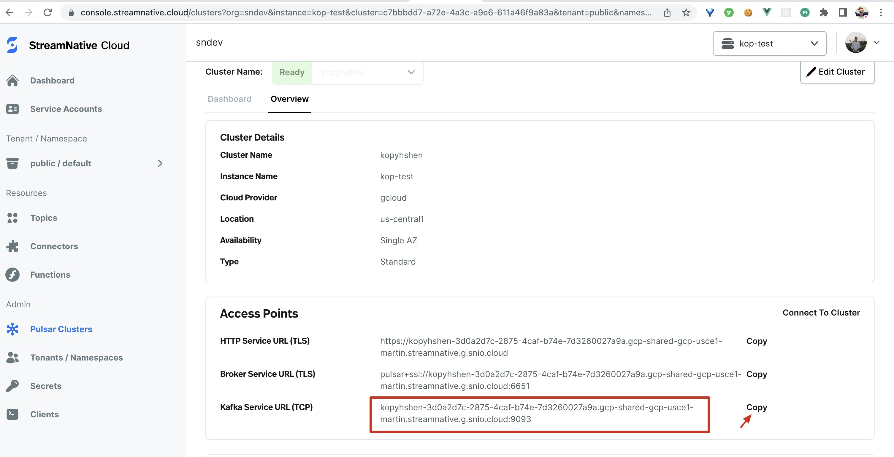

## Prerequisites

1️⃣ Follow [getting started with Lenses](https://docs.lenses.io/5.1/installation/getting-started/) to install Lenses on your machine.

2️⃣ Follow [this tutorial](https://www.notion.so/streamnativeio/StreamNative-Cloud-for-Kafka-DRAFT-6aa74659b5f5495883beaa88e21eabc6) to create a Pulsar cluster and a service account on StreamNative Cloud.

## Setup Lenses to connect to StreamNative Kafka cluster

Fill the settings in Lenses UI:


The `SERVER-URL` can be found in StreamNative Cloud panel:



The `username` is `tenant/namespace`, the password is `token:YOUR-TOKEN`, `YOUR-TOKEN` can be generated and copied in Service Account panel:


## Explore data in Lenses

You can use Lenses to explore data in StreamNative Cloud Kafka Cluster. For example, there is a topic named `kop-topic` in the cluster, you can see the data in the topic:


The message in that topic is JSON string like this one:

```json
{
  "value": {
    "address": {
      "street": "Summer Place",
      "streetNumber": "79",
      "apartmentNumber": "",
      "postalCode": "96518",
      "city": "San Francisco"
    },
    "firstName": "Skylar",
    "middleName": "Skylar",
    "lastName": "Vega",
    "email": "skylarvega@gmail.com",
    "username": "skylarv",
    "password": "BAhSz5sB",
    "sex": "FEMALE",
    "telephoneNumber": "728-020-424",
    "dateOfBirth": -499301348331,
    "age": 69,
    "company": {
      "name": "Klein",
      "domain": "klein.biz",
      "email": "contact@klein.biz",
      "vatIdentificationNumber": "62-0006870"
    },
    "companyEmail": "skylar.vega@klein.biz",
    "nationalIdentityCardNumber": "860-15-3193",
    "nationalIdentificationNumber": "",
    "passportNumber": "TbfdoEIBP"
  }
}
```

You can use SQL query to explore data in this topic:

