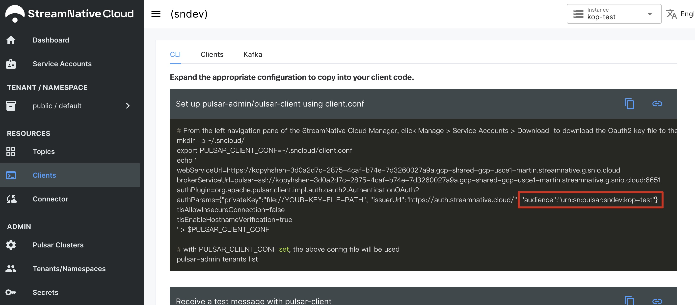

Follow [this tutorial](https://docs.google.com/document/d/1yonds3Sk_aXGFWyCtl7buzTpJt6f5vUM_H8sryVNEwE/edit) to create a Pulsar cluster and a service account.

1. Add Kafka Stream and OAuth maven dependencies:

```xml
<dependency>
    <groupId>org.apache.kafka</groupId>
    <artifactId>kafka-streams</artifactId>
    <version>3.1.0</version>
</dependency>
<dependency>
    <groupId>io.streamnative.pulsar.handlers</groupId>
    <artifactId>oauth-client</artifactId>
    <version>2.9.1.5</version>
</dependency>
<dependency>
    <groupId>org.slf4j</groupId>
    <artifactId>slf4j-log4j12</artifactId>
    <version>1.7.30</version>
</dependency>
```

If you encounter the `java.lang.UnsatisfiedLinkError` when start stream application, you can add rocksDB dependeny to fix this error:

```xml
<dependency>
    <groupId>org.rocksdb</groupId>
    <artifactId>rocksdbjni</artifactId>
    <version>7.0.3</version>
</dependency>
```


2. Write a simple Kafka Stream application named `wordcount-application`:

```java

import io.streamnative.pulsar.handlers.kop.security.oauth.OauthLoginCallbackHandler;
import java.util.concurrent.CountDownLatch;
import org.apache.kafka.common.serialization.Serdes;
import org.apache.kafka.common.utils.Bytes;
import org.apache.kafka.streams.KafkaStreams;
import org.apache.kafka.streams.StreamsBuilder;
import org.apache.kafka.streams.StreamsConfig;
import org.apache.kafka.streams.kstream.KStream;
import org.apache.kafka.streams.kstream.KTable;
import org.apache.kafka.streams.kstream.Materialized;
import org.apache.kafka.streams.state.KeyValueStore;

import java.util.Arrays;
import java.util.Properties;
import org.apache.log4j.BasicConfigurator;
import org.apache.log4j.Level;
import org.apache.log4j.Logger;

public class SNWordCountApplication {

    public static void main(final String[] args) {

        BasicConfigurator.configure();
        Logger.getRootLogger().setLevel(Level.INFO);

        // replace these config with your cluster
        String serverUrl = "SERVER-URL";
        String keyPath = "YOUR-KEY-FILE-PATH";
        String audience = "YOUR-AUDIENCE-STRING";

        // 1. Create Kafka Stream properties
        Properties props = new Properties();
        // stream application name
        props.put(StreamsConfig.APPLICATION_ID_CONFIG, "wordcount-application");
        props.put(StreamsConfig.BOOTSTRAP_SERVERS_CONFIG, serverUrl);
        props.put(StreamsConfig.DEFAULT_KEY_SERDE_CLASS_CONFIG, Serdes.String().getClass());
        props.put(StreamsConfig.DEFAULT_VALUE_SERDE_CLASS_CONFIG, Serdes.String().getClass());

        // OAuth config
        props.setProperty("sasl.login.callback.handler.class", OauthLoginCallbackHandler.class.getName());
        props.setProperty("security.protocol", "SASL_SSL");
        props.setProperty("sasl.mechanism", "OAUTHBEARER");
        final String jaasTemplate = "org.apache.kafka.common.security.oauthbearer.OAuthBearerLoginModule required"
                + " oauth.issuer.url=\"%s\""
                + " oauth.credentials.url=\"%s\""
                + " oauth.audience=\"%s\";";
        props.setProperty("sasl.jaas.config", String.format(jaasTemplate,
                "https://auth.streamnative.cloud/",
                "file://" + keyPath,
                audience
        ));

        // 2. Stream process
        String inputTopic = "persistent://public/default/TextLinesTopic";

        StreamsBuilder builder = new StreamsBuilder();
        KStream<String, String> textLines = builder.stream(inputTopic);
        KTable<String, Long> wordCounts = textLines
                .flatMapValues(textLine -> {
                    System.out.println("stream application receive: " + textLine);
                    return Arrays.asList(textLine.toLowerCase().split("\\W+"));
                })
                .groupBy((key, word) -> word)
                .count(Materialized.<String, Long, KeyValueStore<Bytes, byte[]>>as("counts-store"));
        wordCounts.toStream()
                .foreach((word, count) -> System.out.println("word: " + word + " -> " + count));

        KafkaStreams streams = new KafkaStreams(builder.build(), props);

        final CountDownLatch latch = new CountDownLatch(1);
        Runtime.getRuntime().addShutdownHook(new Thread("stream") {
            @Override
            public void run() {
                streams.close();
                latch.countDown();
            }
        });

        try {
            // 3. Start the stream
            streams.start();
            latch.await();
        } catch (InterruptedException e) {
            e.printStackTrace();
        }
        System.exit(0);
    }
}
```

The `YOUR-KEY-FILE-PATH` is the path of the OAuth key file of your servie account.

The `YOUR-AUDIENCE-STRING` can be found in StreamNative Cloud panel:



The `SERVER-URL` can be found in StreamNative Cloud panel too:


3. Before run this application named `wordcount-application`, you should create two topics `wordcount-application-counts-store-repartition` and `wordcount-application-counts-store-changelog`. They are associated with this stream application.

You can create topics on the website:


4. Run the Java code, then use Kafka CLI to send messages to the input topic `TextLinesTopic`:

```bash
./bin/kafka-console-producer.sh \
    --bootstrap-server `SERVER-URL` \
    --producer.config ./kafka.properties \
    --topic TextLinesTopic
```

Type some text:

```shell
hello world
hello world hello world
```

Then your Java application will receive these message, accumulate and print the world count:

```shell
stream application receive: hello world
stream application receive: hello world hello world
word: hello -> 3
word: world -> 3
```