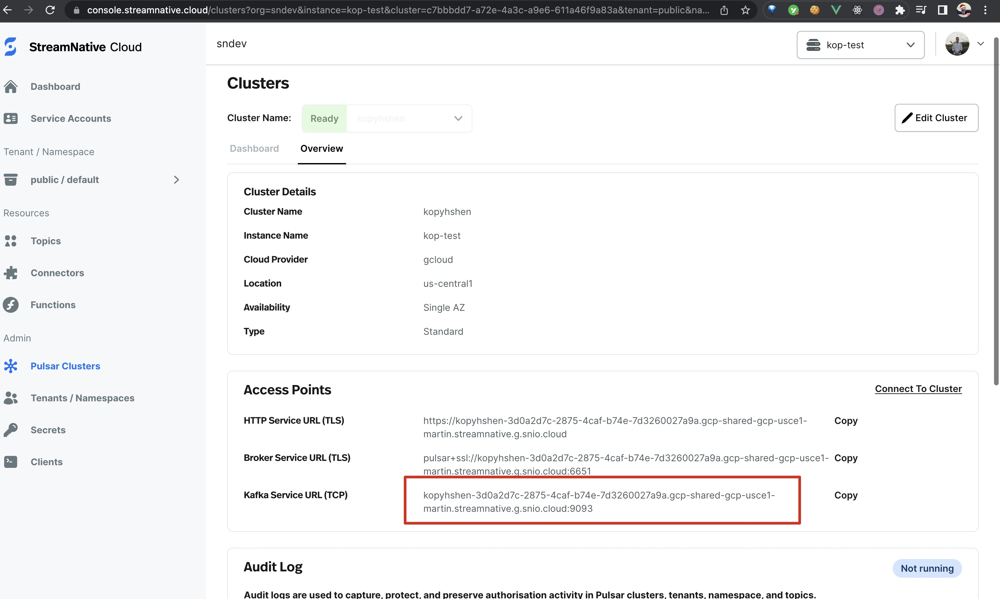
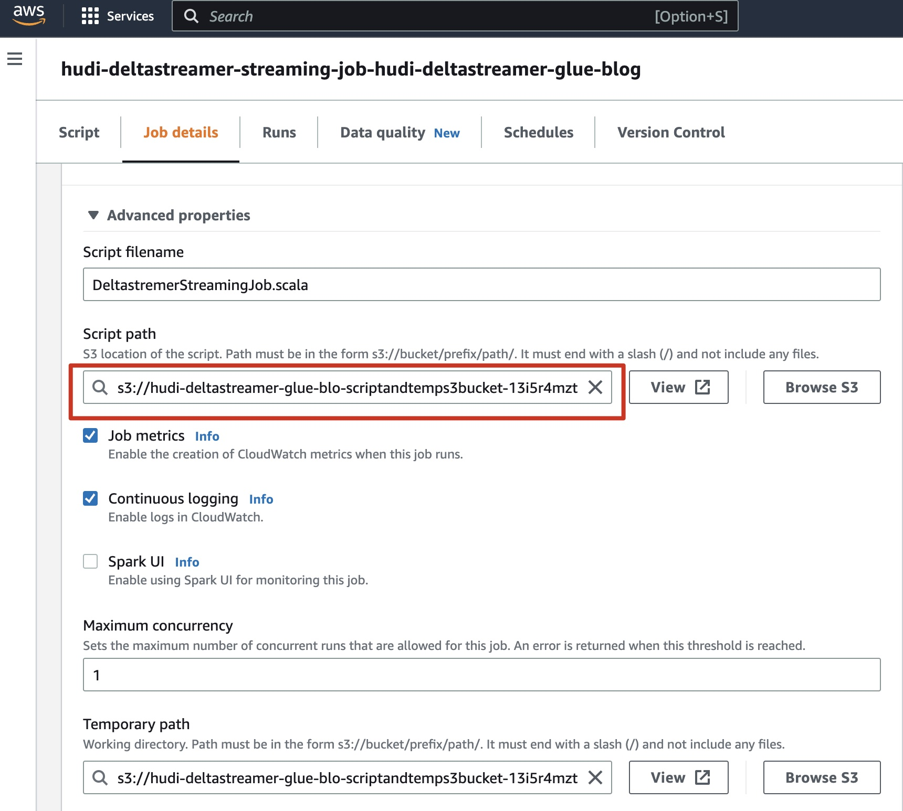
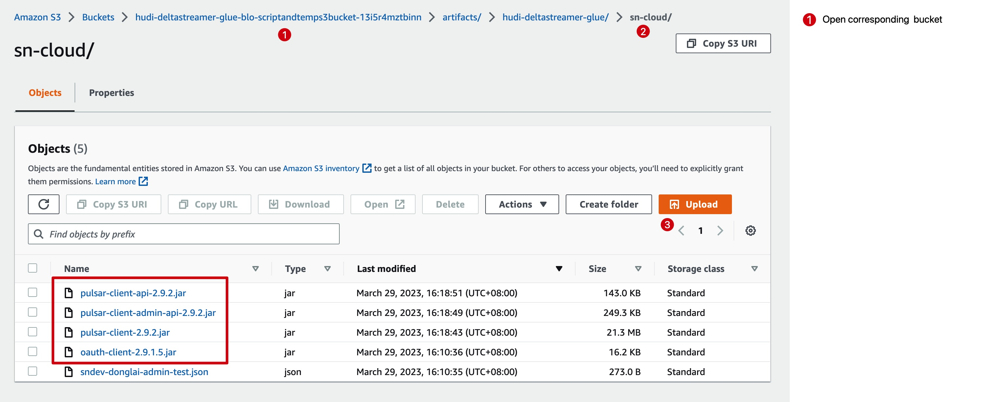
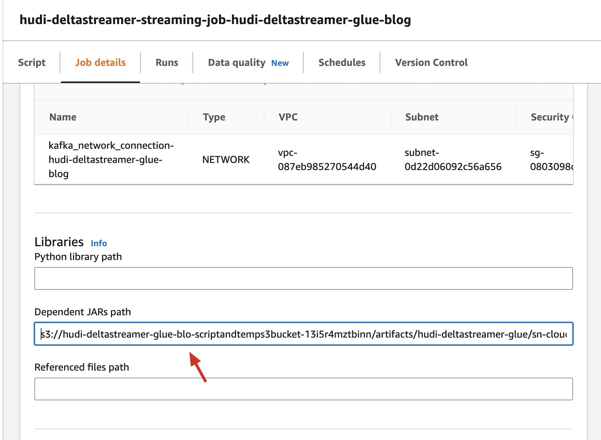
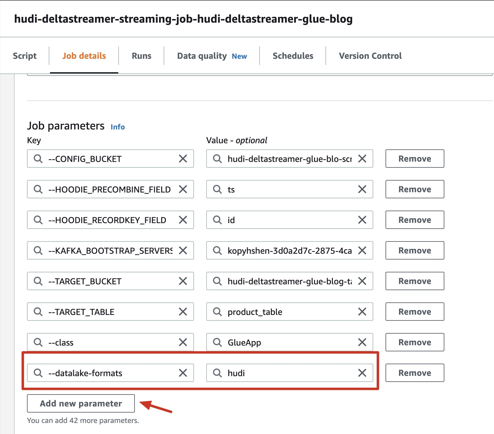
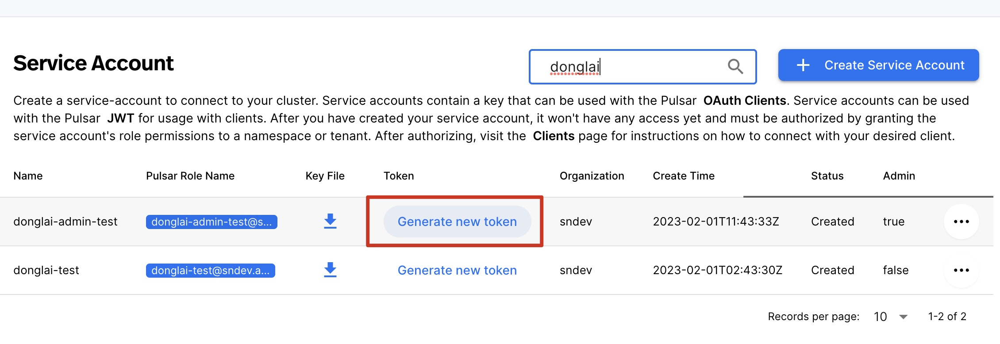
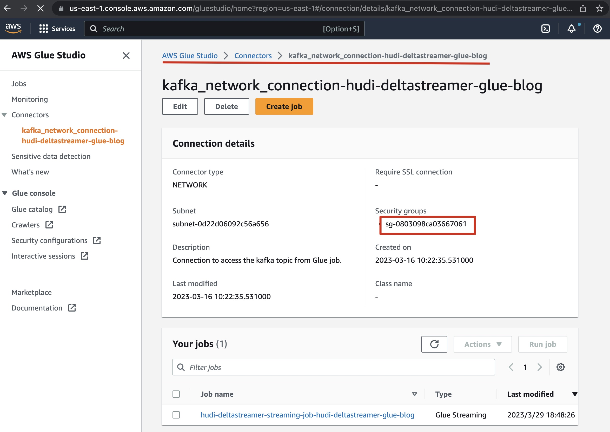
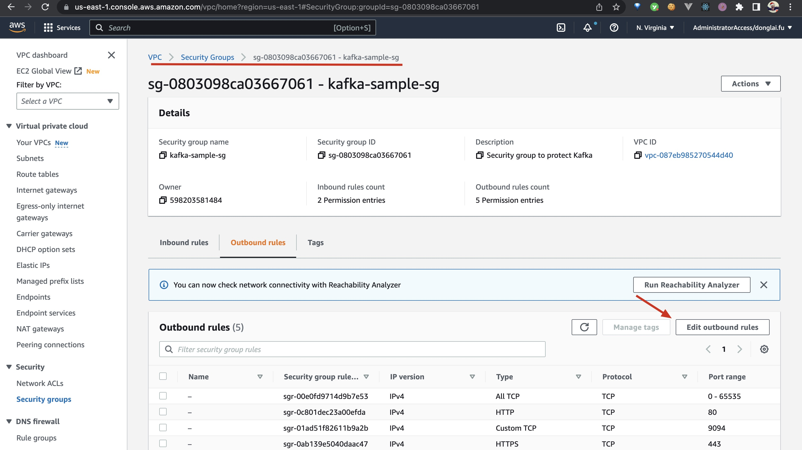
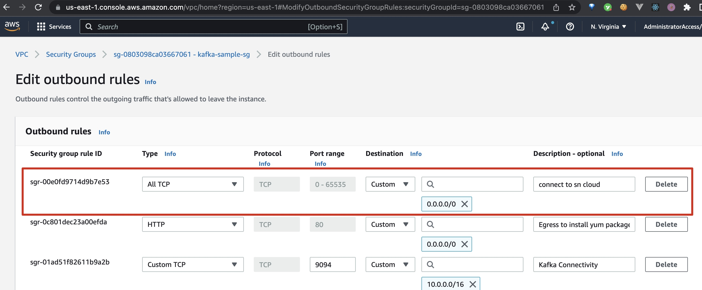

This tutorial is based on [Ingest streaming data to Apache Hudi tables using AWS Glue and Apache Hudi DeltaStreamer](https://aws.amazon.com/cn/blogs/big-data/ingest-streaming-data-to-apache-hudi-tables-using-aws-glue-and-apache-hudi-deltastreamer/). Fix many mistakes and use StreamNative Cloud as the Kafka cluster (data source).

## Prerequisites

1️⃣ We use an [AWS CloudFormation template](http://aws.amazon.com/cloudformation) to provision some resources for our solution. So you need a AWS account first.

2️⃣ Follow [this tutorial](https://www.notion.so/streamnativeio/StreamNative-Cloud-for-Kafka-DRAFT-6aa74659b5f5495883beaa88e21eabc6) to create a Pulsar cluster and a service account on StreamNative Cloud.


## Create the Apache Hudi connection

To add the Apache Hudi Connector for AWS Glue, complete the following steps:

1.  On the AWS Glue Studio console, choose **Connectors**.
2.  Choose **Go to AWS Marketplace**.
3.  Search for and choose **Apache Hudi Connector for AWS Glue**.  
    [](https://d2908q01vomqb2.cloudfront.net/b6692ea5df920cad691c20319a6fffd7a4a766b8/2022/09/26/bdb-2298-image003.png)
4.  Choose **Continue to Subscribe**.  
    [](https://d2908q01vomqb2.cloudfront.net/b6692ea5df920cad691c20319a6fffd7a4a766b8/2022/09/26/bdb-2298-image005.png)
5.  Review the terms and conditions, then choose **Accept Terms**.  
    [](https://d2908q01vomqb2.cloudfront.net/b6692ea5df920cad691c20319a6fffd7a4a766b8/2022/09/26/bdb-2298-image007.png)  
    After you accept the terms, it takes some time to process the request.  
    [](https://d2908q01vomqb2.cloudfront.net/b6692ea5df920cad691c20319a6fffd7a4a766b8/2022/09/26/bdb-2298-image009.png)When the subscription is complete, you see the **Effective date** populated next to the product.
6.  Choose **Continue to Configuration**.  
    [](https://d2908q01vomqb2.cloudfront.net/b6692ea5df920cad691c20319a6fffd7a4a766b8/2022/09/26/bdb-2298-image011.png)
7.  For **Fulfillment option**, choose **Glue 3.0**.
8.  For **Software version**, choose **0.10.1**.
9.  Choose **Continue to Launch**.  
    [](https://d2908q01vomqb2.cloudfront.net/b6692ea5df920cad691c20319a6fffd7a4a766b8/2022/09/26/bdb-2298-image013.png)
10.  Choose **Usage instructions**, and then choose **Activate the Glue connector from AWS Glue Studio**.  
    [](https://d2908q01vomqb2.cloudfront.net/b6692ea5df920cad691c20319a6fffd7a4a766b8/2022/09/26/bdb-2298-image015.png)  
    You’re redirected to AWS Glue Studio.
11.  For **Name**, enter `Hudi-Glue-Connector`.
12.  Choose **Create connection and activate connector**.  
    [](https://d2908q01vomqb2.cloudfront.net/b6692ea5df920cad691c20319a6fffd7a4a766b8/2022/09/26/bdb-2298-image017.png)

A message appears that the connection was successfully created. Verify that the connection is visible on the AWS Glue Studio console.

[](https://d2908q01vomqb2.cloudfront.net/b6692ea5df920cad691c20319a6fffd7a4a766b8/2022/09/26/bdb-2298-image019.png)

## Launch the CloudFormation stack

For this post, we provide a CloudFormation template to create the following resources:

-   VPC, subnets, security groups, and VPC endpoints
-   [AWS Identity and Access Management](http://aws.amazon.com/iam) (IAM) roles and policies with required permissions
-   An AWS Glue Streaming DeltaStreamer job to consume the incoming data from the Kafka topic and write it to Amazon S3
-   Two S3 buckets: one of the buckets stores code and config files, and other is the target for the AWS Glue streaming DeltaStreamer job

To create the resources, complete the following steps:

1.  Click [here](https://console.aws.amazon.com/cloudformation/home?region=us-east-1#/stacks/create/template?stackName=hudi-deltastreamer&templateURL=https://aws-bigdata-blog.s3.amazonaws.com/artifacts/hudi-deltastreamer-glue/hudi-deltastreamer-glue-cfn.yaml) to **Launch Stack**.  

2.  For **Stack name**, enter `hudi-deltastreamer-glue-blog`.
3.  For **ClientIPCIDR**, enter the IP address of your client that you use to connect to the EC2 instance.
4.  For **HudiConnectionName**, enter the AWS Glue connection you created earlier (`Hudi-Glue-Connector`).
5.  For **KeyName**, choose the name of the EC2 key pair that you created as a prerequisite.
6.  For **VpcCIDR**, leave as is.
7.  Choose **Next**.  
    [](https://d2908q01vomqb2.cloudfront.net/b6692ea5df920cad691c20319a6fffd7a4a766b8/2022/09/26/bdb-2298-image021.png)
8.  Choose **Next**.
9.  On the **Review** page, select **I acknowledge that AWS CloudFormation might create IAM resources with custom names**.
10.  Choose **Create stack**.

After the CloudFormation template is complete and the resources are created, the **Outputs** tab shows the following information:

-   **HudiDeltastreamerGlueJob** – The AWS Glue streaming job name
-   **PublicIPOfEC2InstanceForTunnel** – The public IP of the EC2 instance for tunnel
-   **TargetS3Bucket** – The S3 bucket name

[](https://d2908q01vomqb2.cloudfront.net/b6692ea5df920cad691c20319a6fffd7a4a766b8/2022/09/26/bdb-2298-image023.png)

## Send data to the StreamNative Pulsar cluster

Next, SSH to Amazon EC2 using the key pair you created and run the following commands:

1. Follow [Connect StreamNative Cloud with Kafka CLI](../kop-on-sn-cloud/kop-with-cli.md) to config the kafka CLI for the StreamNative Pulsar cluster.

2. Perpare data for the topic. Copy the following json data into a file named `init_data.json`:

```json
{"id": 1, "category": "Apparel", "ts": "2022-01-02 10:29:00", "name": "ABC shirt", "quantity": 4}
{"id": 2, "category": "Apparel", "ts": "2022-01-02 10:29:00", "name": "XYZ shirt", "quantity": 10}
{"id": 3, "category": "Footwear", "ts": "2022-01-02 10:29:00", "name": "DEF shoes", "quantity": 6}
{"id": 4, "category": "Cosmetics", "ts": "2022-01-02 10:29:00", "name": "GHI makeup box", "quantity": 8}
```

The following is the schema of a record ingested into the Pulsar topic:

```json
{
  "type":"record",
  "name":"products",
  "fields":[{
     "name": "id",
     "type": "int"
  }, {
     "name": "category",
     "type": "string"
  }, {
     "name": "ts",
     "type": "string"
  },{
     "name": "name",
     "type": "string"
  },{
     "name": "quantity",
     "type": "int"
  }
]}
```

The schema uses the following parameters:

-   **id** – The product ID
-   **category** – The product category
-   **ts** – The timestamp when the record was inserted or last updated
-   **name** – The product name
-   **quantity** – The available quantity of the product in the inventory


3. Create the topic `hudi-deltastream-demo` in the StreamNative Pulsar cluster and send the data to this topic:

```bash
./bin/kafka-console-producer.sh --bootstrap-server <your-broker-url> --producer.config ./kafka.properties --topic hudi-deltastream-demo < init_data.json
```

The following is the schema of a record ingested into the Kafka topic:

The schema uses the following parameters:

-   **id** – The product ID
-   **category** – The product category
-   **ts** – The timestamp when the record was inserted or last updated
-   **name** – The product name
-   **quantity** – The available quantity of the product in the inventory


## Config and Start the AWS Glue Streaming Job

To start the AWS Glue streaming job, complete the following steps:

1.  On the AWS Glue Studio console, find the job with the value for `HudiDeltastreamerGlueJob`.
2.  Choose the job to review the script and job details.
3.  On the **Job details** tab, replace the value of the `--KAFKA_BOOTSTRAP_SERVERS` key with the broker service URL of StreamNative Cloud cluster:
    

    

4. Upload the necessary dependency packages for the Glue job to an S3 storage bucket.

    You can download the following Pulsar packages to your computer:

    ```bash
    curl -O https://repo1.maven.org/maven2/io/streamnative/pulsar/handlers/oauth-client/2.9.1.5/oauth-client-2.9.1.5.jar --output-dir .

    curl -O https://repo1.maven.org/maven2/org/apache/pulsar/pulsar-client-admin-api/2.9.2/pulsar-client-admin-api-2.9.2.jar --output-dir .

    curl -O https://repo1.maven.org/maven2/org/apache/pulsar/pulsar-client/2.9.2/pulsar-client-2.9.2.jar --output-dir .

    curl -O https://repo1.maven.org/maven2/org/apache/pulsar/pulsar-client-api/2.9.2/pulsar-client-api-2.9.2.jar --output-dir .
    ```

    Create a folder named `sn-cloud` in the S3 bucket of the script path. Then upload these dependency packages to the `sn-cloud` folder:

    

    

5. Config the JARs path and datalake formats for the Glue Job. The JARs path is the S3 URIs of the dependency packages uploaded in last step, concat the URIs by comma. The `--datalake-formats` is `hudi`:
    
    
    

6. Config the OIDC token for StreamNative Pulsar cluster.

    Copy this Glue job code to the editor in the `Scipt` tab:

    ```scala
    import com.amazonaws.services.glue.GlueContext
    import com.amazonaws.services.glue.MappingSpec
    import com.amazonaws.services.glue.errors.CallSite
    import com.amazonaws.services.glue.util.GlueArgParser
    import com.amazonaws.services.glue.util.Job
    import com.amazonaws.services.glue.util.JsonOptions
    import org.apache.spark.SparkContext
    import scala.collection.JavaConverters._
    import org.apache.spark.sql.SparkSession
    import org.apache.spark.api.java.JavaSparkContext
    import org.apache.hudi.utilities.deltastreamer.HoodieDeltaStreamer
    import org.apache.hudi.utilities.deltastreamer.SchedulerConfGenerator
    import org.apache.hudi.utilities.UtilHelpers

    object GlueApp {
    def main(sysArgs: Array[String]) {

    val args = GlueArgParser.getResolvedOptions(
        sysArgs, Seq("JOB_NAME","TARGET_BUCKET","CONFIG_BUCKET","KAFKA_BOOTSTRAP_SERVERS", "TARGET_TABLE", "HOODIE_RECORDKEY_FIELD", "HOODIE_PRECOMBINE_FIELD").toArray)
    
    var config = Array(
            "--schemaprovider-class", "org.apache.hudi.utilities.schema.FilebasedSchemaProvider", 
            "--source-class", "org.apache.hudi.utilities.sources.JsonKafkaSource",
            "--source-ordering-field", "ts", 
            "--target-base-path", "s3://"+ args("TARGET_BUCKET") + "/" + args("TARGET_TABLE") + "/", 
            "--target-table", args("TARGET_TABLE"), 
            "--table-type" , "COPY_ON_WRITE",
            "--enable-hive-sync",
            // schema of message
            "--hoodie-conf", "hoodie.deltastreamer.schemaprovider.source.schema.file=s3://" + args("CONFIG_BUCKET") + "/artifacts/hudi-deltastreamer-glue/config/schema.avsc", 
            "--hoodie-conf", "hoodie.deltastreamer.schemaprovider.target.schema.file=s3://" + args("CONFIG_BUCKET") + "/artifacts/hudi-deltastreamer-glue/config/schema.avsc", 
            "--hoodie-conf", "hoodie.deltastreamer.source.kafka.topic=hudi-deltastream-demo", 
            "--hoodie-conf", "hoodie.datasource.hive_sync.table="+ args("TARGET_TABLE") + "",
            "--hoodie-conf", "hoodie.datasource.write.recordkey.field=" +args("HOODIE_RECORDKEY_FIELD") + "", 
            "--hoodie-conf", "hoodie.datasource.write.precombine.field=" +args("HOODIE_PRECOMBINE_FIELD") + "",
            "--hoodie-conf", "hoodie.datasource.write.operation=UPSERT",
            "--hoodie-conf", "hoodie.datasource.hive_sync.use_jdbc=false",
            "--hoodie-conf", "hoodie.datasource.hive_sync.partition_extractor_class=org.apache.hudi.hive.NonPartitionedExtractor",
            "--hoodie-conf", "hoodie.datasource.write.keygenerator.class=org.apache.hudi.keygen.NonpartitionedKeyGenerator",
            "--hoodie-conf", "hoodie.consistency.check.enabled=true",
            "--hoodie-conf", "auto.offset.reset=earliest", 
            "--hoodie-conf", "bootstrap.servers=" + args("KAFKA_BOOTSTRAP_SERVERS"), 
            // my config
            "--hoodie-conf", "security.protocol=SASL_SSL",
            "--hoodie-conf", "sasl.mechanism=PLAIN",
            // username is 'tenant/namespace', password is 'token:' + '<your-OIDC-token>'
            "--hoodie-conf", "sasl.jaas.config=org.apache.kafka.common.security.plain.PlainLoginModule required username=\"public/default\" password=\"token:<replace-with-your-OIDC-token>\";",
            "--continuous"
        )

    val cfg = HoodieDeltaStreamer.getConfig(config)
    val additionalSparkConfigs = SchedulerConfGenerator.getSparkSchedulingConfigs(cfg)
    val jssc = UtilHelpers.buildSparkContext("delta-streamer-test", "jes", additionalSparkConfigs)

    val spark = jssc.sc
    val glueContext: GlueContext = new GlueContext(spark)
    Job.init(args("JOB_NAME"), glueContext, args.asJava)

    try {
        new HoodieDeltaStreamer(cfg, jssc).sync();
        } finally {
        jssc.stop();
        }

    
        Job.commit()
    }
    }
    ```

    You can get your OIDC token in StreamNative Cloud web console:

    

7. Allow Glue Job to access the public network to connect StreamNative Cloud Cluster.

    First find the `Connection` associated with the Glue Job, you can see the security group ID:

    

    Search this security group ID, then edit outbound rules:

    

    Allow all IP adress and ports for connecting StreamNative Cloud:

    

8.  Choose **Save** to save the job settings.
9.  Choose **Run** to start the job.

    

When the AWS Glue streaming job runs, the records from the topic of StreamNative Cluster are consumed and written to the target S3 bucket created by AWS CloudFormation. To find the bucket name, check the stack’s **Outputs** tab for the `TargetS3Bucket` key value.


The data in Amazon S3 is stored in Parquet file format. In this example, the data written to Amazon S3 isn’t partitioned, but you can enable partitioning by specifying `hoodie.datasource.write.partitionpath.field=<column_name>` as the partition field and setting `hoodie.datasource.write.hive_style_partitioning` to True in the Hudi configuration property in the AWS Glue job script.

In this post, we write the data to a non-partitioned table, so we set the following two Hudi configurations:

-   `hoodie.datasource.hive_sync.partition_extractor_class is set to org.apache.hudi.hive.NonPartitionedExtractor`
-   `hoodie.datasource.write.keygenerator.class is set to org.apache.hudi.keygen.NonpartitionedKeyGenerator`

## DeltaStreamer options and configuration

DeltaStreamer has multiple [options](https://hudi.apache.org/docs/hoodie_deltastreamer/) available; the following are the options set in the AWS Glue streaming job used in this post:

-   **continuous** – DeltaStreamer runs in continuous mode running source-fetch.
-   **enable-hive-sync** – Enables table sync to the Apache Hive Metastore.
-   **schemaprovider-class** – Defines the class for the schema provider to attach schemas to the input and target table data.
-   **source-class** – Defines the source class to read data and has many built-in options.
-   **source-ordering-field** – The field used to break ties between records with the same key in input data. Defaults to ts (the Unix timestamp of record).
-   **target-base-path** – Defines the path for the target Hudi table.
-   **table-type** – Indicates the Hudi storage type to use. In this post, it’s set to `COPY_ON_WRITE`.

The following are some of the important DeltaStreamer configuration properties set in the AWS Glue streaming job:

The configuration contains the following details:

-   **hoodie.deltastreamer.schemaprovider.source.schema.file** – The schema of the source record
-   **hoodie.deltastreamer.schemaprovider.target.schema.file** – The schema for the target record.
-   **hoodie.deltastreamer.source.kafka.topic** – The source StreamNative Cluster topic name
-   **bootstap.servers** – The StreamNative Cluster bootstrap server’s private endpoint
-   **auto.offset.reset** – The consumer’s behavior when there is no committed position or when an offset is out of range

## Hudi configuration

The following are some of the important Hudi configuration options, which enable us to achieve in-place updates for the generated schema:

-   **hoodie.datasource.write.recordkey.field** – The record key field. This is the unique identifier of a record in Hudi.
-   **hoodie.datasource.write.precombine.field** – When two records have the same record key value, Apache Hudi picks the one with the largest value for the pre-combined field.
-   **hoodie.datasource.write.operation** – The operation on the Hudi dataset. Possible values include UPSERT, INSERT, and BULK\_INSERT.

## AWS Glue Data Catalog table

The AWS Glue job creates a Hudi table in the Data Catalog mapped to the Hudi dataset on Amazon S3. Because the `hoodie.datasource.hive_sync.table` configuration parameter is set to `product_table`, the table is visible under the `default` database in the [Data Catalog]().

The following screenshot shows the Hudi table column names in the Data Catalog.


## Query the data using Athena

With the Hudi datasets available in Amazon S3, you can query the data using [Athena](https://us-east-1.console.aws.amazon.com/athena/home?region=us-east-1#query-editor). Let’s use the following query:

```sql
SELECT * FROM "default"."product_table";
```

The following screenshot shows the query output. The table `product_table` has four records from the initial ingestion: two records for the category `Apparel`, one for `Cosmetics`, and one for `Footwear`.


## Load incremental data into the Kafka topic

Now suppose that the store sold some quantity of apparel and footwear and added a new product to its inventory, as shown in the following code. The store sold two items of product ID 1 (`Apparel`) and one item of product ID 3 (`Footwear`). The store also added the `Cosmetics` category, with product ID 5.

Let’s ingest the incremental data to the Kafka topic and query the data from Athena.

Copy following json data into a file named `incr_data.json`:

```json
{"id": 1, "category": "Apparel", "ts": "2022-01-02 10:45:00", "name": "ABC shirt", "quantity": 2}
{"id": 3, "category": "Footwear", "ts": "2022-01-02 10:50:00", "name": "DEF shoes", "quantity": 5}
{"id": 5, "category": "Cosmetics", "ts": "2022-01-02 10:55:00", "name": "JKL Lip gloss", "quantity": 7}
```

Send these data to the topic:

```bash
./bin/kafka-console-producer.sh --bootstrap-server <your-broker-url> --producer.config ./kafka.properties --topic hudi-deltastream-demo < incr_data.json
```

Within a few seconds, you should see a new Parquet file created in the target S3 bucket under the `product_table` prefix. The following is the screenshot from Athena after the incremental data ingestion showing the latest updates.


## Additional considerations

There are some hard-coded Hudi options in the AWS Glue Streaming job scripts. These options are set for the sample table that we created for this post, so update the options based on your workload.

## Clean up

To avoid any incurring future charges, delete the CloudFormation stack, which deletes all the underlying resources created by this post, except for the product\_table table created in the default database. Manually delete the product\_table table under the default database from the Data Catalog.

## Conclusion

In this post, we illustrated how you can add the Apache Hudi Connector for AWS Glue and perform streaming ingestion into an S3 data lake using Apache Hudi DeltaStreamer with AWS Glue. You can use the Apache Hudi Connector for AWS Glue to create a serverless streaming pipeline using AWS Glue streaming jobs with the DeltaStreamer utility to ingest data from Kafka. We demonstrated this by reading the latest updated data using Athena in near-real time.

As always, AWS welcomes feedback. If you have any comments or questions on this post, please share them in the comments.