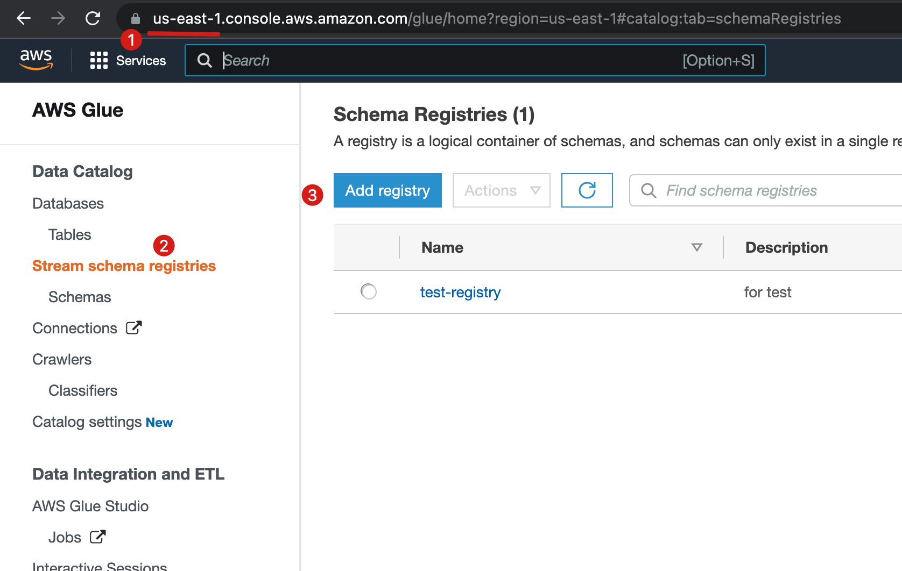

## Create a Schema on AWS Glue Studio

1️⃣ Create a Schema Registry on AWS Glue Studio, sepcify your region and registry name:



In this example I use `us-east-1` as my region and `test-registry` as my registry name.

Java client won't create schema automatically, so we have to create schema manually.

2️⃣ Click the `Add schema` button, I create a schema named `user` with the following schema:

```json
{
  "namespace": "aws_schema_registry.integrationtests",
  "type": "record",
  "name": "User",
  "fields": [
    {"name": "name", "type": "string"},
    {"name": "Age", "type": "int"}
  ]
}
```

This schema will be used for the producer when send messages.

And you need to get the credentials (`AWS_ACCESS_KEY_ID`, `AWS_SECRET_ACCESS_KEY`, `AWS_SESSION_TOKEN`) of your AWS account, which can be found in AWS console. 

You should set them as envoriment variables or install [AWS Toolkit](https://docs.aws.amazon.com/toolkit-for-jetbrains/latest/userguide/key-tasks.html#key-tasks-install).The Java client need them to connect to Glue Schema Registry.

## Create a Pulsar Cluster on StreamNative Cloud

1️⃣ Follow [this tutorial](https://www.notion.so/streamnativeio/StreamNative-Cloud-for-Kafka-DRAFT-6aa74659b5f5495883beaa88e21eabc6) to create a Pulsar cluster and a service account.

2️⃣ You need some credentials to connect Pulsar cluster, which can be found in StreamNative Cloud panel. We will use them later.

The `YOUR-SERVER-URL` can be found in StreamNative Cloud panel:


The `YOUR-KEY-FILE-PATH` is the local path of the OAuth key file of your servie account.

The `YOUR-AUDIENCE-STRING` can be found in StreamNative Cloud panel:


## Use Java Kafka client to produce/consume messages with Schema Registry

1️⃣ In this example we will use Kafak Java client and AWS Glue schema registry, so we need to add these maven dependencies:

```xml
<dependency>
    <groupId>org.apache.kafka</groupId>
    <artifactId>kafka-clients</artifactId>
    <version>3.1.0</version>
</dependency>

<!-- the oauth2 handlers of streamnative cloud -->
<dependency>
    <groupId>io.streamnative.pulsar.handlers</groupId>
    <artifactId>oauth-client</artifactId>
    <version>2.8.3.1</version>
</dependency>

<!-- Avro dependencies -->
<dependency>
    <groupId>org.apache.avro</groupId>
    <artifactId>avro</artifactId>
    <version>1.11.0</version>
</dependency>

<!-- AWS Glue Schema Registry dependencies -->
<dependency>
    <groupId>software.amazon.glue</groupId>
    <artifactId>schema-registry-serde</artifactId>
    <version>1.1.15</version>
</dependency>
```

2️⃣ Create a producer and send messages.

First we should create a schema file `user.avsc` in `src/main/resources/user.avsc` for producer:

```json
{
  "namespace": "aws_schema_registry.integrationtests",
  "type": "record",
  "name": "User",
  "fields": [
    {"name": "name", "type": "string"},
    {"name": "Age", "type": "int"}
  ]
}
```

Then we can create a producer to send messages:

```java
package org.example;

import com.amazonaws.services.schemaregistry.serializers.GlueSchemaRegistryKafkaSerializer;
import com.amazonaws.services.schemaregistry.utils.AWSSchemaRegistryConstants;
import io.streamnative.pulsar.handlers.kop.security.oauth.OauthLoginCallbackHandler;
import java.io.File;
import kotlinx.serialization.SerializationException;
import org.apache.avro.Schema;
import org.apache.avro.generic.GenericData;
import org.apache.avro.generic.GenericRecord;
import org.apache.kafka.clients.producer.KafkaProducer;
import org.apache.kafka.clients.producer.ProducerConfig;
import org.apache.kafka.clients.producer.ProducerRecord;
import org.apache.kafka.common.serialization.StringSerializer;
import java.io.IOException;
import java.util.Properties;
import java.util.concurrent.ExecutionException;
import org.apache.log4j.BasicConfigurator;
import org.apache.log4j.Level;
import org.apache.log4j.Logger;
import software.amazon.awssdk.services.glue.model.DataFormat;

/**
 * An OAuth2 authentication example of Kafka producer to StreamNative Cloud with AWS Glue Schema Registry.
 */
public class SNCloudOAuth2ProducerAWS {
    public static void main(String[] args) throws ExecutionException, InterruptedException, IOException {
        BasicConfigurator.configure();
        Logger.getRootLogger().setLevel(Level.INFO);

        // replace these config with your cluster
        String serverUrl = "YOUR-SERVER-URL";
        String keyPath = "Your-KEY-FILE-PATH";
        String audience = "Your-AUDIENCE-STRING";
        String issueUrl = "https://auth.streamnative.cloud/";

        // 1. Create properties of StreamNative oauth2 authentication, which is equivalent to SASL/PLAIN mechanism in Kafka
        final Properties properties = new Properties();
        properties.put(ProducerConfig.BOOTSTRAP_SERVERS_CONFIG, serverUrl);
        properties.put(ProducerConfig.KEY_SERIALIZER_CLASS_CONFIG, StringSerializer.class);
        properties.put(ProducerConfig.VALUE_SERIALIZER_CLASS_CONFIG, StringSerializer.class);
        properties.setProperty("sasl.login.callback.handler.class", OauthLoginCallbackHandler.class.getName());
        properties.setProperty("security.protocol", "SASL_SSL");
        properties.setProperty("sasl.mechanism", "OAUTHBEARER");
        final String jaasTemplate = "org.apache.kafka.common.security.oauthbearer.OAuthBearerLoginModule required"
                + " oauth.issuer.url=\"%s\""
                + " oauth.credentials.url=\"%s\""
                + " oauth.audience=\"%s\";";
        properties.setProperty("sasl.jaas.config", String.format(jaasTemplate,
                issueUrl,
                "file://" + keyPath,
                audience
        ));

        // 2. Set the schema registry properties
        final String schemaName = "persistent-public-default-glue-test-value";
        final String registryName = "test-registry";
        String topicName = "persistent://public/default/aws-glue-test";

        properties.put(ProducerConfig.KEY_SERIALIZER_CLASS_CONFIG, StringSerializer.class.getName());
        properties.put(ProducerConfig.VALUE_SERIALIZER_CLASS_CONFIG, GlueSchemaRegistryKafkaSerializer.class.getName());
        properties.put(AWSSchemaRegistryConstants.DATA_FORMAT, DataFormat.AVRO.name());
        properties.put(AWSSchemaRegistryConstants.AWS_REGION, "us-east-1");
        properties.put(AWSSchemaRegistryConstants.REGISTRY_NAME, registryName);
        properties.put(AWSSchemaRegistryConstants.SCHEMA_NAME, schemaName);

        Schema schema_payment = null;
        org.apache.avro.Schema.Parser parser = new org.apache.avro.Schema.Parser();
        try {
            schema_payment = parser.parse(new File("src/main/resources/user.avsc"));
        } catch (IOException e) {
            e.printStackTrace();
            System.exit(1);
        }


        // 3. Create a producer and send messages
        try (KafkaProducer<String, GenericRecord> producer = new KafkaProducer<>(properties)) {
            for (int i = 0; i < 4; i++) {
                GenericRecord r = new GenericData.Record(schema_payment);
                r.put("name", "Tom");
                r.put("Age", i);
                // 3. Produce messages
                final ProducerRecord<String, GenericRecord> record;
                record = new ProducerRecord<>(topicName, null, r);

                producer.send(record);
                System.out.println("Sent message " + i);
                Thread.sleep(1000L);
            }
            producer.flush();
            System.out.println("Successfully produced 4 messages to a topic called " + topicName);

        } catch (final InterruptedException | SerializationException e) {
            e.printStackTrace();
        }

    }
}
```

Replace your credentials and run the code, you will see the result:

```text
...
Sent message 0
Sent message 1
Sent message 2
Sent message 3
...
```

3️⃣ Create a consumer and receive messages.

```java
package org.example;

import com.amazonaws.services.schemaregistry.deserializers.GlueSchemaRegistryKafkaDeserializer;
import com.amazonaws.services.schemaregistry.utils.AWSSchemaRegistryConstants;
import com.amazonaws.services.schemaregistry.utils.AvroRecordType;
import io.streamnative.pulsar.handlers.kop.security.oauth.OauthLoginCallbackHandler;
import java.time.Duration;
import java.util.Collections;
import java.util.Properties;
import org.apache.avro.generic.GenericRecord;
import org.apache.kafka.clients.consumer.ConsumerConfig;
import org.apache.kafka.clients.consumer.ConsumerRecord;
import org.apache.kafka.clients.consumer.ConsumerRecords;
import org.apache.kafka.clients.consumer.KafkaConsumer;
import org.apache.kafka.common.serialization.StringDeserializer;
import org.apache.log4j.BasicConfigurator;
import org.apache.log4j.Level;
import org.apache.log4j.Logger;

/**
 * An OAuth2 authentication example of Kafka consumer to StreamNative Cloud with AWS Glue Schema Registry.
 */
public class SNCloudOAuth2ConsumerAWS {
    public static void main(String[] args) {
        BasicConfigurator.configure();
        Logger.getRootLogger().setLevel(Level.INFO);

        // replace these config with your cluster
        String serverUrl = "Your-SERVER-URL";
        String keyPath = "Your-KEY-FILE-PATH";
        String audience = "Your-AUDIENCE-STRING";

        // 1. Create properties of StreamNative oauth2 authentication, which is equivalent to SASL/PLAIN mechanism in Kafka
        final Properties properties = new Properties();
        properties.put(ConsumerConfig.BOOTSTRAP_SERVERS_CONFIG, serverUrl);
        properties.put(ConsumerConfig.KEY_DESERIALIZER_CLASS_CONFIG, StringDeserializer.class);
        properties.put(ConsumerConfig.VALUE_DESERIALIZER_CLASS_CONFIG, StringDeserializer.class);
        properties.put(ConsumerConfig.GROUP_ID_CONFIG, "hello-world");
        properties.put(ConsumerConfig.AUTO_OFFSET_RESET_CONFIG, "earliest");
        properties.setProperty("sasl.login.callback.handler.class", OauthLoginCallbackHandler.class.getName());
        properties.setProperty("security.protocol", "SASL_SSL");
        properties.setProperty("sasl.mechanism", "OAUTHBEARER");
        final String jaasTemplate = "org.apache.kafka.common.security.oauthbearer.OAuthBearerLoginModule required"
                + " oauth.issuer.url=\"%s\""
                + " oauth.credentials.url=\"%s\""
                + " oauth.audience=\"%s\";";
        properties.setProperty("sasl.jaas.config", String.format(jaasTemplate,
                "https://auth.streamnative.cloud/",
                "file://" + keyPath,
                audience
        ));

        // 2. Set AWS Glue Schema Registry properties
        properties.put(ConsumerConfig.KEY_DESERIALIZER_CLASS_CONFIG, StringDeserializer.class.getName());
        properties.put(ConsumerConfig.VALUE_DESERIALIZER_CLASS_CONFIG,
                GlueSchemaRegistryKafkaDeserializer.class.getName());
        properties.put(AWSSchemaRegistryConstants.AWS_REGION, "us-east-1");
        properties.put(AWSSchemaRegistryConstants.AVRO_RECORD_TYPE, AvroRecordType.GENERIC_RECORD.getName());


        // 3. Create Kafka consumer
        String topicName = "persistent://public/default/aws-glue-test";
        try (final KafkaConsumer<String, GenericRecord> consumer = new KafkaConsumer<String, GenericRecord>(
                properties)) {
            consumer.subscribe(Collections.singletonList(topicName));

            while (true) {
                final ConsumerRecords<String, GenericRecord> records = consumer.poll(100);
                for (final ConsumerRecord<String, GenericRecord> record : records) {
                    final String key = record.key();
                    final GenericRecord value = record.value();
                    System.out.println("Received message: key = " + key + ", value = " + value);
                }
            }
        }
    }
}
```

Replace your credentials and run the code, you will see the result:

```text
...
Received message: key = null, value = {"name": "Tom", "Age": 0}
Received message: key = null, value = {"name": "Tom", "Age": 1}
Received message: key = null, value = {"name": "Tom", "Age": 2}
Received message: key = null, value = {"name": "Tom", "Age": 3}
```