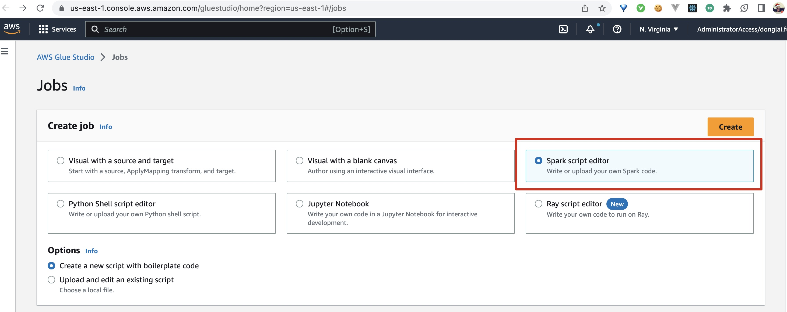
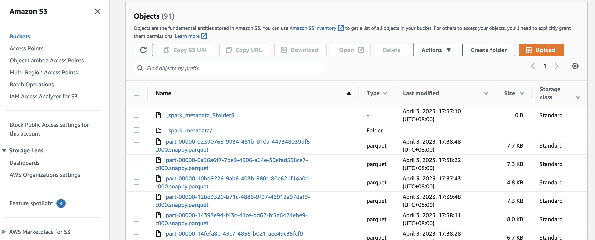

## Prerequisites

1️⃣ Follow [this tutorial](https://www.notion.so/streamnativeio/StreamNative-Cloud-for-Kafka-DRAFT-6aa74659b5f5495883beaa88e21eabc6) to create a Pulsar cluster and a service account on StreamNative Cloud.

2️⃣ Create a Spark script editor on [Glue Studio Jobs](https://us-east-1.console.aws.amazon.com/gluestudio/home?region=us-east-1#/jobs).



## Create a pyspark script to read data from StreamNative Cloud

1️⃣ Copy the following code to the script editor:

```python
import sys
from awsglue.transforms import *
from awsglue.utils import getResolvedOptions
from pyspark.context import SparkContext
from awsglue.context import GlueContext
from awsglue.job import Job

## @params: [JOB_NAME]
args = getResolvedOptions(sys.argv, ['JOB_NAME'])

sc = SparkContext()
glueContext = GlueContext(sc)
spark = glueContext.spark_session
job = Job(glueContext)
job.init(args['JOB_NAME'], args)

# Kafka parameters
kafka_params = {
    # service url of streamnative cluster (replace with yours)
    "kafka.bootstrap.servers": "YOUR-SERVICE-URL",
    "kafka.security.protocol": "SASL_SSL",
    "kafka.sasl.mechanism": "PLAIN",
    # the example topic name (replace with yours)
    "subscribe": "kop-topic",
    # username and password to connect streamnative cluster (replace with yours)
    "kafka.sasl.jaas.config": "org.apache.kafka.common.security.plain.PlainLoginModule required username=\"public/default\" password=\"token:YOUR-TOKEN\";"
}

# Read messages from the Kafka topic
kafka_df = spark.readStream \
    .format("kafka") \
    .options(**kafka_params) \
    .load()

# Select the value column and cast it to a string
kafka_messages = kafka_df.selectExpr("CAST(value AS STRING)")

# store the messages to s3
query = kafka_messages.writeStream \
    .outputMode("append") \
    .format("parquet") \
    # the target data path (replace with yours)
    .option("path", "s3://hudi-deltastreamer-glue-blog-targets3bucket-xc37xtipp61e/donglai-test/data/") \
    .option("checkpointLocation", "s3://hudi-deltastreamer-glue-blog-targets3bucket-xc37xtipp61e/donglai-test/checkpoint/") \
    .start()

query.awaitTermination()

job.commit()
```

The `SERVER-URL` can be found in StreamNative Cloud panel:


The `YOUR-TOKEN` can be generated and copied in Service Account panel:


2️⃣ Click the **Run** button to run the script. Then this script will read data from the `kop-topic` and write the data to the target S3 path.

3️⃣ After sending some data to `kop-topic`, there shoud be some output data in the target S3 path:



You can simply use the following command to read the data in S3:

```python
import boto3
import pandas as pd
import tempfile

# Configure your AWS credentials (replace with yours)
aws_access_key_id=''
aws_secret_access_key=''
aws_session_token=''

s3 = boto3.client(
    's3',
    aws_access_key_id=aws_access_key_id,
    aws_secret_access_key=aws_secret_access_key,
    aws_session_token=aws_session_token
)

# Specify the S3 bucket and Parquet file (replace with yours)
bucket_name = 'hudi-deltastreamer-glue-blog-targets3bucket-xc37xtipp61e'
parquet_key = 'donglai-test/data/part-00000-f71dbf63-c16b-463f-b6b8-2bda20c80955-c000.snappy.parquet'

# Download the Parquet file to a temporary file
with tempfile.NamedTemporaryFile(mode='wb', delete=False) as temp_parquet:
    s3.download_fileobj(bucket_name, parquet_key, temp_parquet)

# Read the Parquet file using pandas
df = pd.read_parquet(temp_parquet.name)

# Print the contents of the DataFrame
print(df)

# Clean up the temporary file
temp_parquet.close()
```

This script will print the data in the Parquet file.