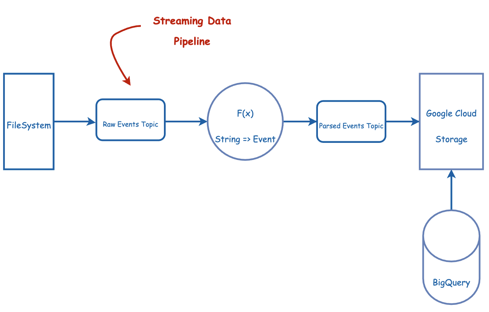

Example Data Pipeline
---------------------


Make sure you have a kubernetes cluster up and running with enough resources to deploy a Pulsar Cluster

1. Create a namespace
```shell
kubectl create ns demo
```

2. Deploy a Pulsar Cluster
```shell
helm install \
--values k8s/values.yaml \
--set initialize=true \
pulsar streamnative/pulsar
```

3. Copy all the necessary resources on the cluster
```shell
./setup.sh
```
This script will execute and will do the following:
- Build the jars file containing our code
- Copy the connector jar file and the generated jar file on the cluster
- Copy the configuration scripts on the cluster
Make sure that the toolset pod name, matches the own of your pod - should be [installation-name]-toolset

4. Deploy the Pulsar Function along with the gcs connector
```shell
./deploy.sh
```

5. Expose the Pulsar Broker address if you want to run your producer from your local machine
```shell
kubectl port-forward service/pulsar-proxy 6650:6650 8080:8080 -n demo
```

6. Run the EventProducer

At this point you should have sent data into Pulsar and if you navigate to your Google Cloud Storage page
you should see 5 avro files. 

With your avro files in place, open a new tab for BigQuery and create a new table
